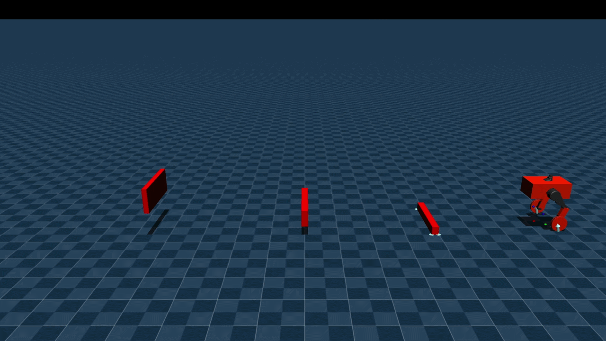
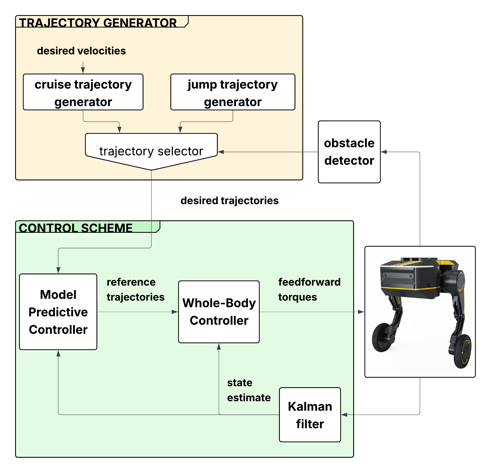

# Acrobatic obstacle avoidance for the TITA two-wheel legged robot

This repository contains the work developed for the Master’s thesis at Sapienza University of Rome, focused on **acrobatic obstacle avoidance through jumping maneuvers** for the TITA two-wheel legged robot.

The proposed control framework enables the robot to safely overcome sudden obstacles appearing along its path by performing dynamic jumping maneuvers while preserving locomotion stability and navigation performance.

The framework combines trajectory generation, predictive control, whole-body control, and state estimation through sensor fusion.

The approach has been validated through simulation in MuJoCo and through initial experiments on the real robotic platform. Further experimental validations are currently in progress.


<p align="center">
  
</p>


## Project overview 


<p align="center">
  
</p>

The proposed control framework is mainly divided into four core modules:

### 1. Trajectory Generator

The trajectory generator provides the desired reference trajectories for both standard locomotion and obstacle avoidance maneuvers.

It is responsible for:

- nominal locomotion planning  
- jump trajectory generation  
- decision logic switching between locomotion and jumping behaviors
  
---

### 2. Control Block

The control block represents the core of the robot control architecture and is based on a hierarchical framework composed of:

- **Model Predictive Control (MPC)** on a reduced-order *template model*  
- **Whole-Body Control (WBC)** for full robot actuation and constraint handling

---
### 3. Obstacle Detector

The obstacle detector performs real-time detection of sudden obstacles appearing along the robot path computing the relative distance from the obstacle leveraging the ultrasound sensor of the robot.
  
---
### 4. Kalman Filter

A custom Kalman Filter is used to estimate a subset of the full robot state by fusing information from:

- IMU   
- robot odometry

---


## Repository structure
The repository is organized into three main components:

```text
TITA-dynamic-obstacle-avoidance/
│
├── MPC_open_loop/      # Additional MPC implementations and testing
│
├── TITA_MJ/            # MuJoCo simulation environment and controller implementation
│
├── tita_controller/    # Real robot deployment built as ROS2 packages
│
└── ...
```

The control framework is primarily implemented in C++.

For additional implementation details, please refer to the dedicated `README.md` files inside each subdirectory.


## Citations
This project builds upon several important open-source libraries and research contributions in robotics, optimal control, and model predictive control:

- [Nicola Scianca](https://github.com/nickstu) — DDP solver implementation and related research contributions that inspired part of the optimization framework
  
- [Crocoddyl](https://github.com/loco-3d/crocoddyl) — optimal control and Differential Dynamic Programming (DDP) framework for trajectory optimization

- [Pinocchio](https://github.com/stack-of-tasks/pinocchio) — rigid body dynamics and kinematics library used for robot modeling and analytical

- [HPIPM](https://github.com/giaf/hpipm) — high-performance quadratic programming solver for QP

- [MuJoCo](https://github.com/google-deepmind/mujoco) — physics simulation engine used for simulation and validation of jumping maneuvers

- [ROS 2](https://github.com/ros2/ros2) — middleware framework used for real robot deployment, communication, and system integration


## Requirements

The project has been developed and tested using the followig depepndencies:
- CMake     (4.1.2)
- C++17    
- GLFW3     (3.4.0)
- MuJoCo    (3.3.4)
- Pinocchio (3.8.0)
- Crocoddyl (3.1.0)
- [HPIPM](https://github.com/giaf/hpipm)     (linked manually through local installations)
- [BLASFEO](https://github.com/giaf/blasfeo)   (linked manually through local installations)
- ROS 2 Humble 

Python has been used for plots, for python requirements see `py_requirements.txt`.


## Installation

### 1. Clone the repository

```bash
git clone https://github.com/Emilianogith/TITA-dynamic-obstacle-avoidance.git
cd TITA-dynamic-obstacle-avoidance
```

### 2a. Mujoco simulation 
Please referer to the `README.md` inside `TITA_MJ`.


### 2b. ROS2 controller
Please referer to the `README.md` inside `tita_controller`.
